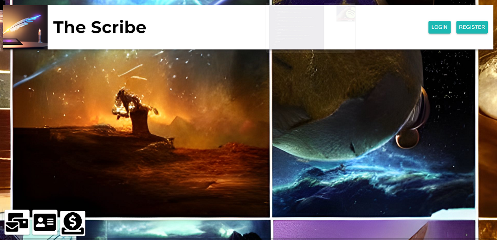
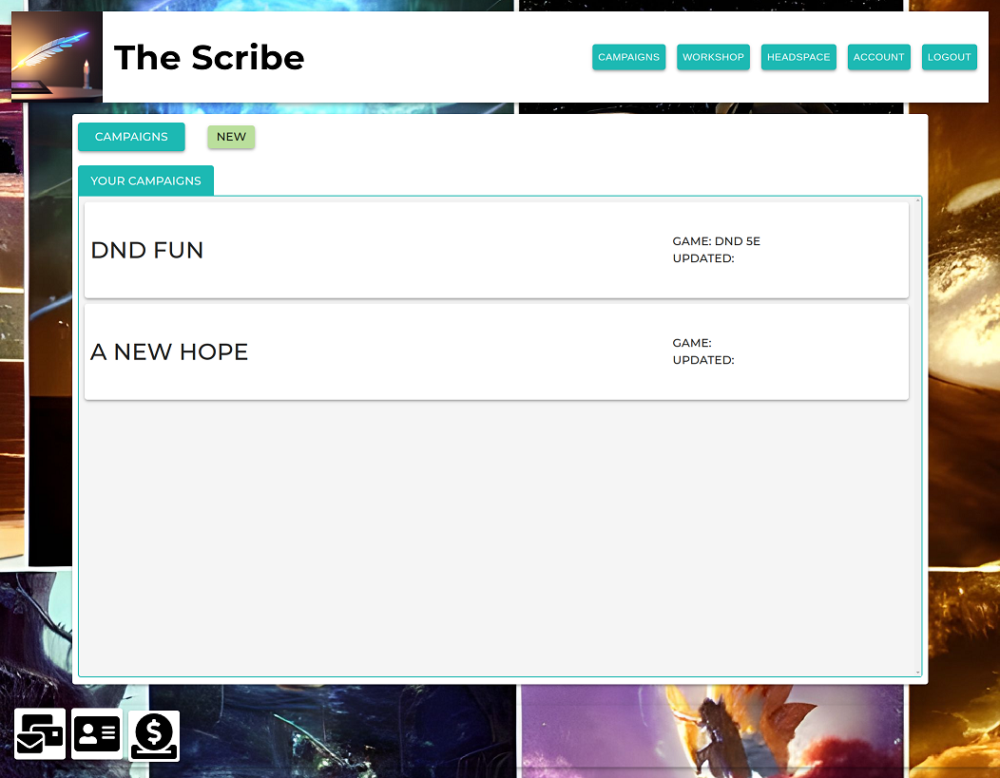

# the-scribe

## Description

A multi-page application targeted towards individuals who would host tabletop games. A user can create stories, characters, side quests, or plots to share with other users on the app. This app was motivated by two of the main contributors being Game Masters throughout the duration of their lives. They wanted a social media style application where other GMs could easily share ideas and garner inspiration, with the ability to increase the depths of their in-game universes. 

## Usage

From our homepage you have the option to register or login. 

Once logged in you have varying options to choose from including campaigns, headspace, workshop, and account, as well as buttons at the bottom of the page for an about, contact, and dontation. 

## Credits

These AI generator sites were utilized for creation of the logo and background. 
Logo: https://hotpot.ai/
Background: https://www.photoroom.com/backgrounds

## License

MIT License

Copyright (c) 2023 JoshuaTaylor

Permission is hereby granted, free of charge, to any person obtaining a copy
of this software and associated documentation files (the "Software"), to deal
in the Software without restriction, including without limitation the rights
to use, copy, modify, merge, publish, distribute, sublicense, and/or sell
copies of the Software, and to permit persons to whom the Software is
furnished to do so, subject to the following conditions:

The above copyright notice and this permission notice shall be included in all
copies or substantial portions of the Software.

## Development Team

<ul>
    <li><a href="https://github.com/josht-dev">Josh Taylor</a></li>
    <li><a href="https://github.com/loudwhisperer">Brendan Borowski</a></li>
    <li><a href="https://github.com/porkchoppy">Christin Carter</a></li>
    <li><a href="https://github.com/artiecannv">Arthur Cann</a></li>
</ul>

